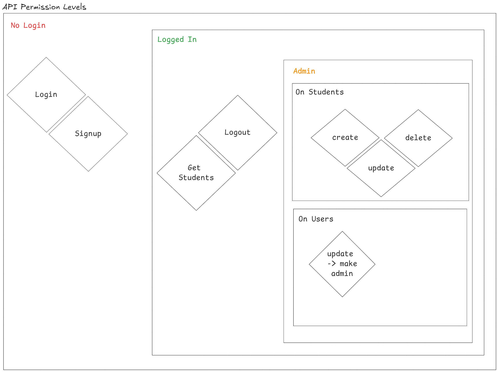

## Bayt Assignment - Website

> Using Laravel PHP framework. We need a website that does as follows:
> - Allows us to List, Add, Delete, and Modify Student information.
> - Has Login, Registration, and Logout
> - Comes up with seeded admin user
> - When you register a new user, that user is regular (non admin)
> - Only admin users are allowed to make other users admin
> - Only admin users are allowed to Edit, Add, Delete students
> - Only regular users and admin users are allowed to list students (i.e. this information is not available to logged out users)
> - Students have id, name, age, and residence location
> - You are welcome to use any SQL database
> - You are welcome to use any PHP or Laravel library
----
## Design 

#### Database
- In terms of the database, we kept it simple and straight to the point.

#### Authorization
- In terms of authorization and access levels, we had the following scheme.

#### Frontend Flow Design
- The basic flow of the application can be seen in the following diagram:

#### Backend Design
- The following is generally how I structure my backend systems

----
## Setup and Usage

- Clone Repository using `git clone https://github.com/Ali-Olliek/Bayt-Assignment-Website.git`
- Or download the release `v1.0`
    - Extract the folder somewhere on your machine.

### Backend

- Change directory to `backend`.
- Run `composer install` to install all dependencies.
- Create a database named `bayt` on MySQL.
- Create a file named `.env`, copy contents from `.env.example` to `.env`.
- Change the value for `DB_DATABASE` to `bayt`.
- Run `php artisan start` which does the following:
    - Migrate the database scheme.
    - Run the seeders:
        - Seed a single admin.
        - Seed 20 Students.
    - Create a JWT Secret In `.env`.
    - Serve the server on port `8000`.

### Frontend

- Change directory to `frontend`
- Run `npm install` or `yarn install`
- Run `npm start` to run the development web app.
- To login as an Admin:
    - Email:`admin@admin.com`
    - Password: `1234qwer`